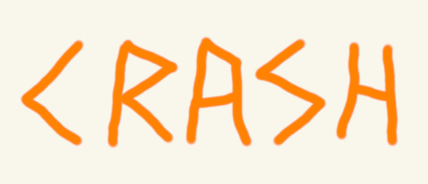
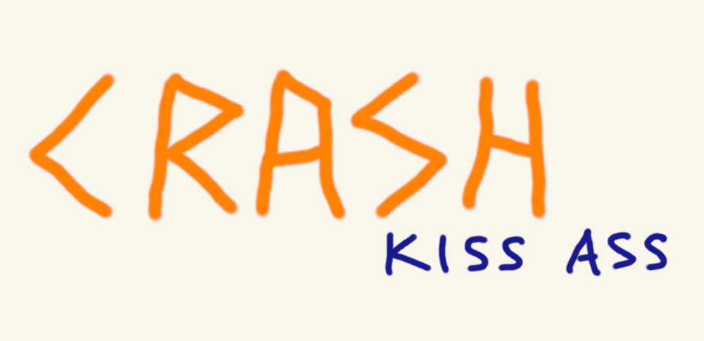
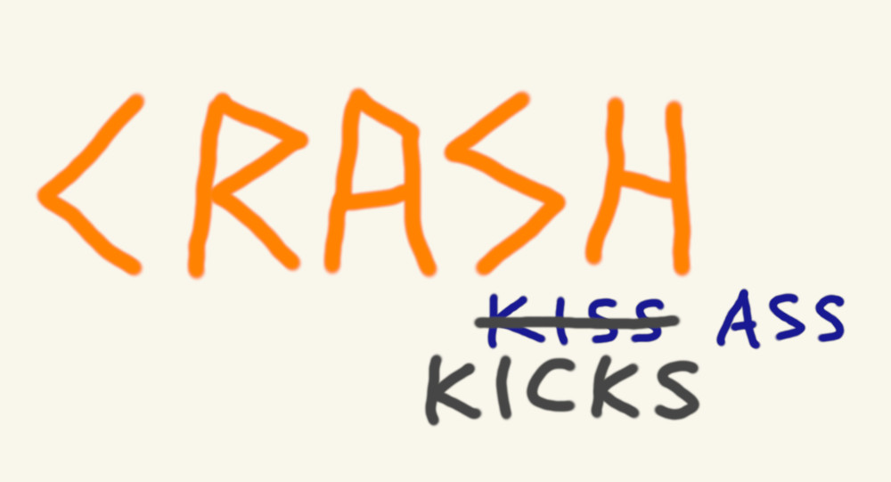

# FKA &ndash; Framework for Kicking Ass #

## The Story ##

It was the summer of 1981, and Fred and I had a lot of time on our hands and decided we wanted to
spruce up our rides.  So we put down some newspaper in my family room, took apart our bikes, then
stripped the frames down to bare metal and repainted them.  Fred painted his a low-key gray; I went
with Wrought Iron Flat Black, with Neon Orange accents.  I carefully masked out the design for the
Neon Orange&mdash;it was a pair of nunchaku on the front of the head tube (okay, so I was going
through a Bruce Lee phase at the time), and a stylized "Crash" running along both sides of the
downtube.  Our bikes came out looking good, once back together, and we were ready to be tearing up
the neighborhood all summer.

Around that same time, they whitewashed the walls in the pedestrian tunnel at the end of 55th
Street, going under Lake Shore Drive and leading out to The Point, where we headed to just about
every day&mdash;along with Alberto, Eric, Niels, and a bunch of other kids&mdash;either to jump into
the lake to cool off, or find people, or just hang out on the rocks.  Hmm...freshly whitewashed
walls...leftover spray paint...dumb teenagers with tons of time on their hands...gee, take a wild
guess as to what might possibly transpire.

So, of course, I found a big empty spot on the south wall of the tunnel and put up my tag (same as
on my bike) using the rest of the Neon Orange:

Imagine my surprise when a few days later I found that someone else using the tunnel&mdash;also
with paint, and apparently time on their hands&mdash;had something not so flattering to say about
my artwork (okay, maybe it was really about me):

Well, Niels&mdash;being the awesome friend&mdash;got angry, grabbed what was left of the Wrought
Iron Flat Black, and made his own edit on the wall:

And that's how it stayed for the rest of the summer.

Hence the name for the framework.

### Postscript ###

By no means do I purport to kick ass all the time (or even whenever I intend to).  But, over the
years, I have learned generally what it takes, and it makes me feel good if I am able to do
something to help other people kick ass, if and when that's what they set out to do.

Hence the framework itself.

## Status ##

This is currently work in process, I am still working on cleaning up the content for the
[College Edition][1], and adding a few more components (Quick Reference and Worksheet).
In addition, I need to figure out a better way to manage the content source and formatting
(see [Implementation Notes][2]).

Current editions:

* [college-edition][1]

## Implementation Notes ##

The source code for all of the material is currently in `.md` files, which I am then
compiling to HTML and post-processing using a Python script.  Pretty ugly stuff.  Will
work on a better framework for managing and publishing, since I would like to support the
ability to easily create and track other "editions" and forks.

## Future ##

I can imagine future editions to include:

* college-insider-edition
* med-school-edition
* professional-edition
* workout-edition
* etc.

## License ##

This project is licensed under the terms of the MIT License.

## Acknowledgements ##

Thanks to Glen for some styling help, and Timmy for discussions and inspiration.

[1]: https://crashka.github.io/fka/college-edition/
[2]: #implementation-notes
